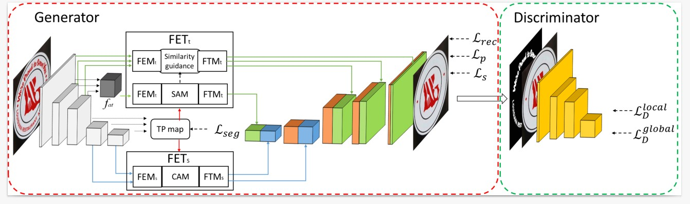
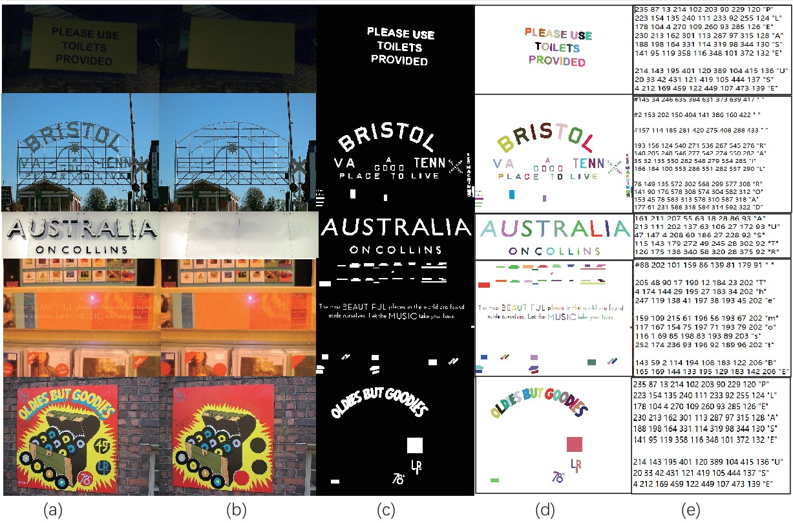

# <p align=center> :fire: `FETNet: Feature Erasing and Transferring Network for Scene Text Removal (PR2023)`</p>

This is the official PyTorch codes for the paper.

[[Arxiv Paper](https://arxiv.org/abs/2306.09593)]  [中文版 (TBD)] [[Project](https://guangtaolyu.github.io/projects/FETNet/index.html)]  [Weights: [baidu yunpan](https://pan.baidu.com/s/13gvAu0eKTl4HbgLxKyTnKA?pwd=2kkw) (pwd:2kkw)  [google_driver](https://drive.google.com/file/d/1mmx41ibyQiLR_duVn6LB3gZw9JcPu3LS/view?usp=drive_link)]



### Dataset

This Flickr-ST dataset is a real world dataset\cite{Scene Text Eraser} including 3,004 images with 2,204 images for training and 800 images for testing. Scene text in Flickr-ST has arbitrary orientation and shape. It provides five types annotations, text removed images (b), pixel-level text masks (c), character instance segmentation labels, category labels and character-level bounding box labels(d). The word-level scene text regions can be calculated simply Implicitly from those labels. To the best of our knowledge, Flickr-ST is the only dataset with such comprehensive annotations for scene text related tasks.




Note: Similiar to SCUT_EnsTex, the Flickr-ST dataset can only be used for non-commercial research purpose. For scholars or organization who wants to use the Flickr-ST database, please first fill in this Application Form and send it via email to us ( [annazhu@whut.edu.cn](mailto:annazhu@whut.edu.cn)). When submiting the application form ( [dropbox](https://www.dropbox.com/s/bd5hkrmglq8502y/Application_Form_for_Using_Flickr_ST.docx?dl=0)) ( [google driver](https://docs.google.com/document/d/1NYRjhXzsmlK7-CMqJVrLOoLghkKL-WQI/edit?usp=drive_link&ouid=105062997338991665366&rtpof=true&sd=true))( [baidu disk](https://pan.baidu.com/s/1RD_R2f0o3WiWiomzsB7uhA?pwd=pg1v ) password:pg1v ) to us, please list or attached 1-2 of your publications in recent 6 years to indicate that you (or your team) do research in the related research fields of OCR, image inpainting, text editting, and so on. We will give you the download link after your letter has been received and approved.

### :page_facing_up: Todo-list
- Gradio Demo
- Colab demo
- Tidy up code that is more standardized and easy to use
- Open Source Scene Text Removal Toolbox


### Requirements

- PyTorch == 1.7.0(1.x)
- CUDA 10.1 

### Train

```python
python run.py  --text_root ./dataset/train/img --mask_root ./dataset/train/mask --gt_root ./dataset/train/inpaint --result_save_path ./results/xxx  
```

### Test

```python
python run.py  --text_root ./dataset/test/img --mask_root ./dataset/test/mask --gt_root ./dataset/test/inpaint --model_path_g ./checkpoint/xxx.pth  --model_path_d ./checkpoint/xxx.pth --result_save_path ./results/xxx  --test
```

### Evaluation

the detection and image equality evaluation metrics reference to EraseNet(https://github.com/lcy0604/EraseNet/blob/master/evaluatuion.py)


### Related work and Repos

https://github.com/lcy0604/EraseNet

https://github.com/lcy0604/CTRNet

https://github.com/HCIILAB/Scene-Text-Removal

https://github.com/naver/garnet

https://github.com/neouyghur/One-stage-Mask-based-Scene-Text-Eraser

https://github.com/clovaai/CRAFT-pytorch

https://github.com/GuangtaoLyu/PSSTRNet

### References

[1]T. Nakamura, A. Zhu, K. Yanai, S. Uchida, Scene text eraser, 2017.

[2]C. Liu, Y. Liu, L. Jin, S. Zhang, Y. Wang, Erasenet: End-to-end text removal in the wild, IEEE Transactions on Image Processing PP (99) (2020) 1–1.

[3]S. Zhang, Y. Liu, L. Jin, Y. Huang, S. Lai, Ensnet: Ensconce text in the wild, in: AAAI, 2019.


## Citation
If you find our repo useful for your research, please cite us:
```
@article{lyu2023fetnet,
  title={FETNet: Feature erasing and transferring network for scene text removal},
  author={Lyu, Guangtao and Liu, Kun and Zhu, Anna and Uchida, Seiichi and Iwana, Brian Kenji},
  journal={Pattern Recognition},
  volume={140},
  pages={109531},
  year={2023},
  publisher={Elsevier}
}
```

## Contact 
If you have any questions, feel free to concat us or raise issues.

Suggestions and opinions of our work (both positive and negative) are welcome. Please contact the authors by sending email to Guangtao Lyu(吕光涛)([1004392768@qq.com](mailto:1004392768@qq.com)) or  Anna Zhu([annazhu@whut.edu.cn](mailto:annazhu@whut.edu.cn))

## Acknowledgement
This repository is maintained by [Guangtao Lyu(吕光涛)](https://github.com/GuangtaoLyu). Personal page: [Guangtao Lyu(吕光涛)](https://guangtaolyu.github.io/)