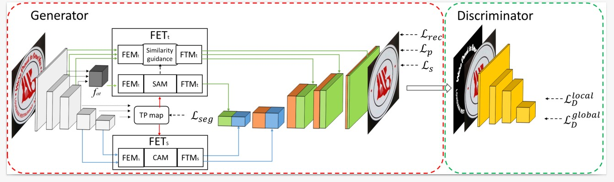
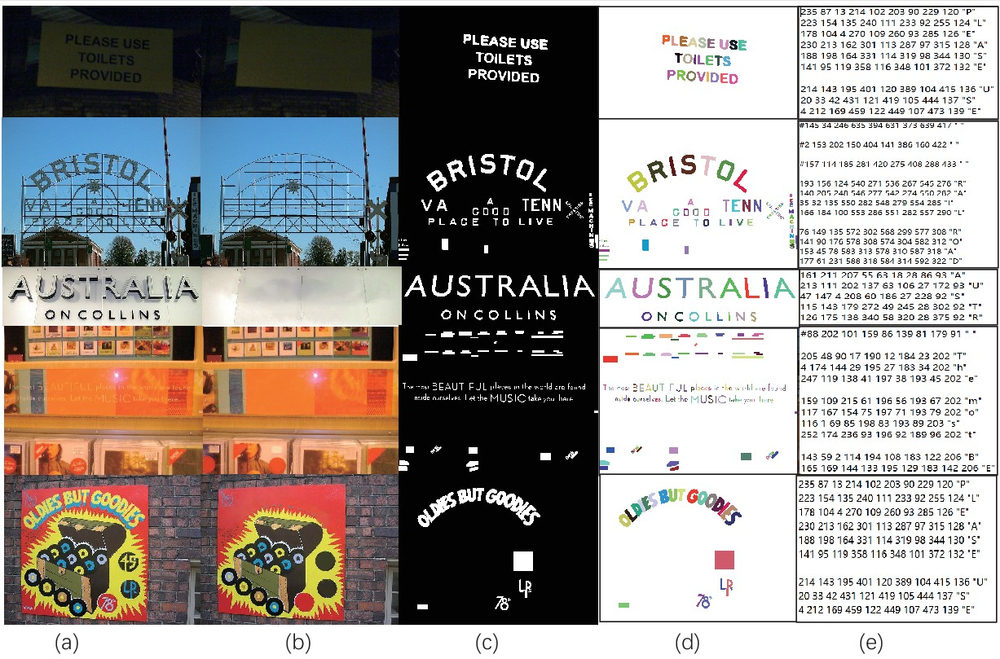

# FETNet
FETNet: Feature Erasing and Transferring Network for Scene Text Removal

### Dataset

This Flickr-ST dataset is a real world dataset\cite{Scene Text Eraser} including 3,004 images with 2,204 images for training and 800 images for testing. Scene text in Flickr-ST has arbitrary orientation and shape. It provides five types annotations, text removed images (b), pixel-level text masks (c), character instance segmentation labels, category labels and character-level bounding box labels(d). The word-level scene text regions can be calculated simply Implicitly from those labels. To the best of our knowledge, Flickr-ST is the only dataset with such comprehensive annotations for scene text related tasks.

### Requirements

- PyTorch == 1.7.0(1.x)
- CUDA 10.

### References

[1]T. Nakamura, A. Zhu, K. Yanai, S. Uchida, Scene text eraser, 2017.

[2]C. Liu, Y. Liu, L. Jin, S. Zhang, Y. Wang, Erasenet: End-to-end text removal in the wild, IEEE Transactions on Image Processing PP (99) (2020) 1–1.

[3]S. Zhang, Y. Liu, L. Jin, Y. Huang, S. Lai, Ensnet: Ensconce text in the wild, in: AAAI, 2019.

